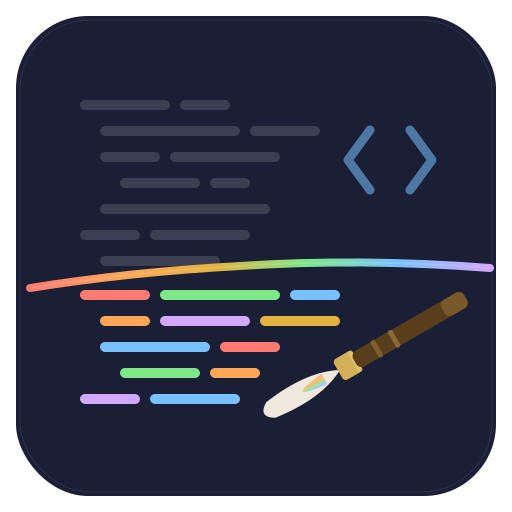
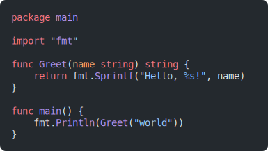

<p align="center">
  
</p>

<h1 align="center">Nuri</h1>

<p align="center">
  <a href="https://pkg.go.dev/github.com/frostybee/nuri"></a>
  <a href="https://github.com/frostybee/nuri/actions/workflows/ci.yml"></a>
  <a href="LICENSE"></a>
  
</p>

## Table of Contents

- [Why native Go?](#why-native-go)
- [Features](#features)
- [Installation](#installation)
- [Quick Start](#quick-start)
- [API Overview](#api-overview)
- [Examples](#examples)
- [Supported Languages and Themes](#supported-languages-and-themes)
- [Performance](#performance)
- [Relationship to Upstream Shiki](#relationship-to-upstream-shiki)
- [Development](#development)
- [Contributing](#contributing)
- [License](#license)

---

Nuri (塗り, "painting") is a pure Go port of [Shiki](https://shiki.style), the TextMate grammar-based syntax highlighter used by VS Code. Full TextMate grammar support: 257 languages, 65+ VS Code themes, and hundreds of hierarchical token scopes. No CGO required.

It runs the real [Oniguruma regex engine](https://github.com/kkos/oniguruma) (compiled to WASM via [wazero](https://wazero.io)) for bug-for-bug compatibility with Shiki's tokenizer.

227 of 234 tested grammars (97%) produce output byte-identical to Shiki, verified against [vscode-textmate](https://github.com/microsoft/vscode-textmate); the core bundle's 32 fidelity-tested grammars are at 100%.

<p align="center">
  
</p>

<p align="center"><em>Go code highlighted with <code>github-dark</code> theme, rendered as SVG by Nuri.</em></p>

## Why native Go?

Shelling out to Node.js or wrapping the JS Shiki bundle in WASM adds a runtime dependency, subprocess overhead, and a non-Go API surface. Nuri gives you Shiki-quality output with none of that: no Node.js install, no subprocess, idiomatic Go (`context.Context`, `fs.FS`, `error` returns), and safe concurrent highlighting out of the box.

## Features

- **Full TextMate grammar engine**: begin/end, begin/while, captures, backreferences, injections, nested grammars, `$self`/`$base`/`#repo` includes
- **Six output formats**: HTML, ANSI terminal, SVG, JSON, plain text, raw tokens
- **Multi-theme mode**: tokenize once, resolve multiple themes via CSS variables
- **Transformer pipeline**: notation comments (`[!code ++]`, `[!code highlight]`), meta string ranges (`{1,3-5}`), visible whitespace, custom hooks
- **Style-to-class mode**: deterministic hashed class names instead of inline styles, with a shared stylesheet across code blocks
- **WCAG 2.1 contrast correction**: automatic foreground color adjustment against the theme background (default ratio 5.5)
- **Concurrency-safe**: bounded pool of WASM instances, safe for parallel highlighting
- **Language detection**: by file extension, exact filename, or first-line shebang
- **Two bundle sizes**: `bundle/core` (38 languages, ~0.5 MB) and `bundle/full` (257 languages, ~1.5 MB)
- **No CGO required**: wazero runs Oniguruma in pure Go; an opt-in `onig_cgo` build tag is available for native throughput

## Installation

Requires **Go 1.25** or later.

```bash
go get github.com/frostybee/nuri
```

Import one of the bundle packages to include grammar and theme assets:

```go
import "github.com/frostybee/nuri/bundle/core"  // 38 popular languages
import "github.com/frostybee/nuri/bundle/full"  // all 257 languages
```

## Quick Start

```go
package main

import (
	"context"
	"fmt"
	"log"

	"github.com/frostybee/nuri"
	"github.com/frostybee/nuri/bundle/core"
)

func main() {
	ctx := context.Background()

	h, err := nuri.New(ctx, nuri.WithFS(core.FS()))
	if err != nil {
		log.Fatal(err)
	}
	defer h.Close(ctx)

	html, err := h.CodeToHTML(ctx, `fmt.Println("hello, world")`, nuri.CodeToHTMLOptions{
		Lang:  "go",
		Theme: "github-dark",
	})
	if err != nil {
		log.Fatal(err)
	}
	fmt.Println(html)
}
```

## API Overview

### Constructor and Lifecycle

```go
// New compiles the WASM engine, instantiates a pool of WASM instances,
// and builds the grammar/theme registry.
func New(ctx context.Context, opts ...Option) (*Highlighter, error)

// Close releases all WASM resources. Safe to call multiple times.
func (h *Highlighter) Close(ctx context.Context) error
```

### Highlighting Methods

All methods take `context.Context` for cancellation and per-line timeout support.

```go
func (h *Highlighter) CodeToHTML(ctx context.Context, code string, opts CodeToHTMLOptions) (string, error)
func (h *Highlighter) CodeToTokens(ctx context.Context, code string, opts CodeToTokensOptions) (*TokensResult, error)
func (h *Highlighter) CodeToANSI(ctx context.Context, code string, opts CodeToANSIOptions) (string, error)
func (h *Highlighter) CodeToSVG(ctx context.Context, code string, opts CodeToSVGOptions) (string, error)
func (h *Highlighter) CodeToJSON(ctx context.Context, code string, opts CodeToJSONOptions) ([]byte, error)
func (h *Highlighter) CodeToPlainText(ctx context.Context, code string, opts CodeToPlainTextOptions) (string, error)
```

### Options

```go
// Assets
nuri.WithFS(fsys fs.FS)                // set grammar + theme filesystem (use bundle/core or bundle/full)
nuri.WithGrammarFS(fsys fs.FS)         // grammar filesystem only
nuri.WithThemeFS(fsys fs.FS)           // theme filesystem only
nuri.WithGrammar(name, data []byte)    // register a custom grammar at construction
nuri.WithTheme(name, data []byte)      // register a custom theme at construction

// Resource management
nuri.WithPoolSize(n int)               // max WASM instances (default: runtime.NumCPU())
nuri.WithMaxLineLength(n int)          // skip tokenization for lines exceeding n bytes
nuri.WithTimeoutMs(ms int)             // per-line soft timeout in milliseconds
nuri.WithCompilationCacheDir(dir)      // on-disk cache for AOT-compiled WASM (cuts cold start)

// Safety
nuri.WithMinContrast(ratio float64)    // WCAG 2.1 contrast ratio (default: 5.5; 0 to disable)
nuri.WithRegexInterruption(bool)       // WASM-level regex cancellation (default: true)

// Convenience
nuri.WithAlias(alias, target string)   // language alias (e.g. "sh" -> "shellscript")
nuri.WithExtension(ext, lang string)   // file extension mapping
nuri.WithDefaults(CodeToHTMLOptions)   // default options applied to every CodeToHTML call
```

### Runtime Registration

```go
h.LoadLanguage(name string, data []byte) error
h.LoadTheme(name string, data []byte) error
h.RegisterAlias(alias, target string)
h.RegisterExtension(ext, lang string)
h.LoadedLanguages() []string
h.LoadedThemes() []string
```

### Language Detection

```go
lang, ok := h.DetectLanguage("main.go")         // by extension or exact filename
lang, ok := h.DetectLanguageByContent("#!/bin/bash")  // by shebang / first line
```

### Theme Colors

```go
colors, err := h.GetThemeColors("github-dark")
// colors.Background, colors.Foreground, colors.Type ("dark"/"light"),
// colors.Colors["editor.selectionBackground"], etc.
```

### Key Types

| Type | Description |
|------|-------------|
| `Highlighter` | Main entry point. Owns WASM resources; must be closed. |
| `TokensResult` | Output of `CodeToTokens`: token grid, theme colors, diagnostics. |
| `ThemedToken` | A token with resolved `Content`, `Color`, `FontStyle`, `Scopes`. |
| `Element` / `Text` | HTML AST nodes with `WriteTo(io.Writer)`. |
| `Transformer` | Interface for HTML pipeline hooks (Preprocess through Postprocess). |
| `BaseTransformer` | Embed for no-op defaults on all `Transformer` hooks. |
| `Diagnostic` | Non-fatal degradation record (timeout, too-long line, panic). |
| `StyleClassMap` | Accumulates style-to-class mappings; call `CSS()` for the stylesheet. |
| `LineRange` | 1-based inclusive line range for decorations. |

### Sentinel Errors

```go
nuri.ErrLanguageNotFound  // unknown language name
nuri.ErrThemeNotFound     // unknown theme name
nuri.ErrGrammarCycle      // cyclic grammar include detected
nuri.ErrGrammarDepth      // grammar include depth limit exceeded
```

All are compatible with `errors.Is`.

## Examples

### Raw Token Access

```go
result, err := h.CodeToTokens(ctx, code, nuri.CodeToTokensOptions{
	Lang:  "javascript",
	Theme: "nord",
})
if err != nil {
	log.Fatal(err)
}
for _, line := range result.Tokens {
	for _, tok := range line {
		fmt.Printf("%-20s %s %s\n", tok.Content, tok.Color, tok.Scopes)
	}
}
```

### ANSI Terminal Output

```go
out, err := h.CodeToANSI(ctx, code, nuri.CodeToANSIOptions{
	Lang:       "python",
	Theme:      "dracula",
	ColorDepth: nuri.ColorDepth256, // or ColorDepthTruecolor (default), ColorDepth16
})
if err != nil {
	log.Fatal(err)
}
fmt.Print(out)
```

### Multi-Theme (Light/Dark CSS Variables)

```go
html, err := h.CodeToHTML(ctx, code, nuri.CodeToHTMLOptions{
	Lang: "typescript",
	Themes: map[string]string{
		"dark":  "github-dark",
		"light": "github-light",
	},
})
```

The lexicographically first key (`"dark"`) becomes the default theme with inline styles. Other themes emit CSS variables (`--nuri-light`, `--nuri-light-bg`).

### Transformers

```go
import "github.com/frostybee/nuri/transformers"

html, err := h.CodeToHTML(ctx, code, nuri.CodeToHTMLOptions{
	Lang:  "go",
	Theme: "github-dark",
	Transformers: []nuri.Transformer{
		transformers.Notation(),       // [!code ++], [!code highlight], [!code focus], etc.
		transformers.Meta("{1,3-5}"),   // highlight lines from fence meta string
		transformers.Whitespace(),      // render tabs/spaces as visible symbols
	},
})
```

Custom transformers embed `nuri.BaseTransformer` and override individual hooks:

```go
type lineNumbers struct {
	nuri.BaseTransformer
}

func (lineNumbers) Name() string { return "line-numbers" }

func (lineNumbers) Line(el *nuri.Element, line int) *nuri.Element {
	el.SetAttr("data-line", strconv.Itoa(line))
	return el
}
```

### Style-to-Class Mode

Replace inline styles with deterministic hashed class names:

```go
classMap := nuri.NewStyleClassMap()

html1, _ := h.CodeToHTML(ctx, goCode, nuri.CodeToHTMLOptions{
	Lang: "go", Theme: "nord", ClassMap: classMap,
})
html2, _ := h.CodeToHTML(ctx, jsCode, nuri.CodeToHTMLOptions{
	Lang: "javascript", Theme: "nord", ClassMap: classMap,
})

css := classMap.CSS() // shared stylesheet for both blocks
```

### SVG Output

```go
svg, err := h.CodeToSVG(ctx, code, nuri.CodeToSVGOptions{
	Lang:         "rust",
	Theme:        "github-dark",
	FontSize:     16,
	CornerRadius: 12,
})
```

### Line Decorations

```go
html, err := h.CodeToHTML(ctx, code, nuri.CodeToHTMLOptions{
	Lang:           "go",
	Theme:          "github-dark",
	HighlightLines: []nuri.LineRange{nuri.Range(3, 5), nuri.Range(10, 10)},
	FocusLines:     nuri.Lines(1, 2, 3),
	InsertedLines:  nuri.Lines(7),
	DeletedLines:   nuri.Lines(8),
})
```

### Custom Grammar or Theme

```go
h, err := nuri.New(ctx,
	nuri.WithFS(core.FS()),
	nuri.WithGrammar("my-lang", myGrammarJSON),
	nuri.WithTheme("my-theme", myThemeJSON),
)
```

Or at runtime:

```go
err := h.LoadLanguage("my-lang", grammarJSON)
err = h.LoadTheme("my-theme", themeJSON)
```

Grammars are standard TextMate JSON format. Themes are VS Code JSON theme format.

### On-Disk Filesystem

Skip embedding entirely and load grammars/themes from disk:

```go
h, err := nuri.New(ctx,
	nuri.WithGrammarFS(os.DirFS("/path/to/grammars")),
	nuri.WithThemeFS(os.DirFS("/path/to/themes")),
)
```

### Standalone Theme Parsing

The `theme` package is exported for independent use:

```go
import "github.com/frostybee/nuri/theme"

thm, err := theme.Parse(themeJSON)
style := thm.Match([]string{"source.go", "keyword.control.go"})
fmt.Println(style.Foreground) // "#ff7b72"
```

## Supported Languages and Themes

**Core bundle** (`bundle/core`): 38 languages, 65 themes.

Languages: bat, c, cpp, csharp, css, docker, go, graphql, html, java, javascript, json, jsonc, jsx, kotlin, lua, markdown, php, python, ruby, rust, scss, shellscript, sql, svelte, swift, toml, tsx, typescript, vue, xml, yaml, and injection helpers (css-in-html, markdown-html, etc.).

**Full bundle** (`bundle/full`): 257 languages, 65 themes. Includes every grammar from [shikijs/textmate-grammars-themes](https://github.com/shikijs/textmate-grammars-themes).

**Themes include**: andromeeda, ayu-dark, catppuccin-mocha, dark-plus, dracula, everforest-dark, github-dark, github-light, min-dark, monokai, nord, one-dark-pro, rose-pine, slack-dark, solarized-dark, tokyo-night, vitesse-dark, and [53 more](bundle/core/themes/).

List available languages and themes at runtime:

```go
fmt.Println(h.LoadedLanguages()) // grammars loaded so far (lazy)
fmt.Println(h.LoadedThemes())    // themes loaded so far (lazy)
```

## Performance

Measured on an amd64 machine with Go 1.26, theme `github-dark`, warm median over 10 iterations. See [`tools/compare/RESULTS.md`](tools/compare/RESULTS.md) for full data including Shiki and Chroma comparisons.

| Input | Warm (ms/op) | Warm no-interrupt (ms/op) | Cold start (ms) |
|---|---:|---:|---:|
| Go (117 B) | 5.0 | 1.3 | 77 |
| HTML (304 B) | 18.6 | 4.0 | 354 |
| JavaScript (309 B) | 28.6 | 7.0 | 557 |
| Markdown (135 B) | 5.0 | 1.6 | 145 |
| TypeScript (203 B) | 15.0 | 4.0 | 677 |

These are small snippets (100-300 bytes). Throughput scales linearly with input size since grammars are compiled once and reused. Cold start is dominated by WASM compilation of the grammar on first use. Use `WithCompilationCacheDir` to persist compiled WASM across runs and eliminate cold starts after the first invocation. The "no-interrupt" column shows throughput with `WithRegexInterruption(false)`, which disables per-regex cancellation checks for a ~3x speedup. See [`tools/compare`](tools/compare/README.md) for running your own benchmarks with larger inputs.

## Relationship to Upstream Shiki

### What is ported

- The full vscode-textmate tokenizer state machine (begin/end, begin/while, captures, backreferences, `\G` anchoring, injection selectors, cross-grammar includes, while-condition checking)
- The Oniguruma regex engine via the same `onig.wasm` binary Shiki uses
- VS Code theme parsing, scope matching with specificity scoring, and `FontStyle` bitmask semantics
- HTML rendering with `<pre><code><span>` structure, multi-theme CSS variable emission, and `styleToClass` mode
- The transformer/hook pipeline matching `@shikijs/transformers` (notation, meta, whitespace)
- ANSI rendering with 8/16/256/truecolor depth

### What differs

- **Idiomatic Go API**: see [Why native Go?](#why-native-go) above.
- **Concurrency model**: Shiki is single-threaded (Node.js). Nuri uses a bounded pool of WASM instances for safe concurrent highlighting.
- **Safety features not in Shiki**: per-line timeout, max-line-length pre-filter, panic recovery with instance poison-swap, WCAG contrast correction.
- **No `codeToHast`**: Nuri returns a Go `Element`/`Text` AST instead of a HAST tree. The structure is equivalent.
- **No semantic tokens**: VS Code's LSP-driven `semanticTokenColors` field is parsed and silently ignored.
- **Whole-buffer API only**: `CodeToTokens` processes the entire input. An incremental `TokenizeLine` entry point is a potential future addition.
- **Deterministic output**: map-backed attributes and styles are emitted in sorted key order. Shiki's output order depends on JS engine iteration order.

### Compatibility

Grammars and themes are sourced from the same upstream repository ([shikijs/textmate-grammars-themes](https://github.com/shikijs/textmate-grammars-themes)). A provenance lockfile pins the exact commit, per-file SHA256 hashes, and Shiki version used to generate golden fixtures. The core bundle's 32 fidelity-tested grammars are at **100%** token-level fidelity against Shiki across both `github-dark` and `github-light` themes.

## Development

```bash
# Clone with submodules
git clone --recurse-submodules https://github.com/frostybee/nuri.git

# Or initialize submodules after cloning
git submodule update --init
```

### Build and test

```bash
go build ./...                                            # build all packages
go test ./...                                             # run all tests
go test ./internal/fidelity/... -run TestGoldenFidelity   # core fidelity matrix
go test -race -count=1 ./...                              # race detector (requires CGO; on Windows use WSL)
```

### Asset and fixture management

All managed through `tools/devtool`:

```bash
go run ./tools/devtool sync       # copy grammars/themes from submodule into bundle/, regenerate lockfile + THIRD-PARTY-NOTICE
go run ./tools/devtool generate   # build vscode-textmate and generate golden test fixtures (requires Node.js 22+)
go run ./tools/devtool all        # sync + generate in one shot
go run ./tools/devtool lock       # regenerate provenance.lock.json only
go run ./tools/devtool notices    # regenerate THIRD-PARTY-NOTICE only
go run ./tools/devtool verify     # check lockfile against working tree (used in CI)
```

### Tools

None of these are part of the module or linked into any binary.

| Tool | Description |
|---|---|
| [`tools/devtool`](tools/devtool/README.md) | Go CLI for syncing grammar/theme assets, managing the provenance lockfile, and generating fidelity fixtures. |
| [`tools/genfixtures`](tools/genfixtures/README.md) | Node.js fixture generator that drives real vscode-textmate and writes golden JSON for the fidelity test suite. |
| [`tools/compare`](tools/compare/README.md) | Benchmark tool that produces speed and fidelity tables comparing Nuri, Shiki, and Chroma. |
| [`tools/race-wsl.sh`](tools/race-wsl.sh) | Bash script that runs the Go race detector inside WSL (Windows only). |

### Demos

Standalone programs in `cmd/demo/` that exercise each output format. The HTML demo is the best starting point for a visual overview of the full feature set.

```bash
go run ./cmd/demo/html             # generate a self-contained HTML showcase (flags: -o <path>, -stdout)
go run ./cmd/demo/ansi             # interactive terminal demo (pages with space/q)
go run ./cmd/demo/svg -o /tmp      # generate SVG files (Go, JS, Rust snippets)
go run ./cmd/demo/json             # print JSON token output to stdout
go run ./cmd/demo/plaintext        # print plain-text (no styling) to stdout
```

## Contributing

1. Fork and create a feature branch.
2. Run `go test ./...` before submitting.
3. Fidelity matters: if you change the tokenizer, run the golden tests (`go test ./internal/fidelity/...`) and confirm no regressions.
4. Grammar and theme updates must regenerate the provenance lockfile (`go run ./tools/devtool sync`).
5. Regenerate fidelity fixtures with `go run ./tools/devtool generate` (requires Node.js 22+) and verify `git diff testdata/` is clean.

Questions and bug reports go to [GitHub Issues](https://github.com/frostybee/nuri/issues). See the [Development](#development) section for setup instructions and [`tools/devtool/README.md`](tools/devtool/README.md) for the full contributor workflow.

## License

Copyright (c) 2026 FrostyBee.

Nuri is licensed under the [MIT License](LICENSE). You are free to use, modify, and distribute it in both open-source and commercial projects.

Nuri embeds third-party components (Oniguruma WASM binary, TextMate grammars, VS Code themes, wazero) under their respective licenses (BSD-2-Clause, MIT, Apache-2.0, and others). See [THIRD-PARTY-NOTICE](THIRD-PARTY-NOTICE) for full attribution and license texts.

---

Full API documentation: [pkg.go.dev/github.com/frostybee/nuri](https://pkg.go.dev/github.com/frostybee/nuri)
